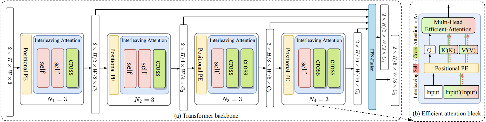

# MatchFormer: Interleaving Attention in Transformers for Feature Matching

### Introduction

In this work, we propose a novel hierarchical extract-and-match transformer, termed as **MatchFormer**. Inside each stage of the hierarchical encoder, we interleave self-attention for feature extraction and cross-attention for feature matching, enabling a human-intuitive **extract-and-match** scheme. 

More detailed can be found in our [arxiv](https://arxiv.org/pdf/2203.09645.pdf) paper.

### Usage

The code and model weights will be release soon.

